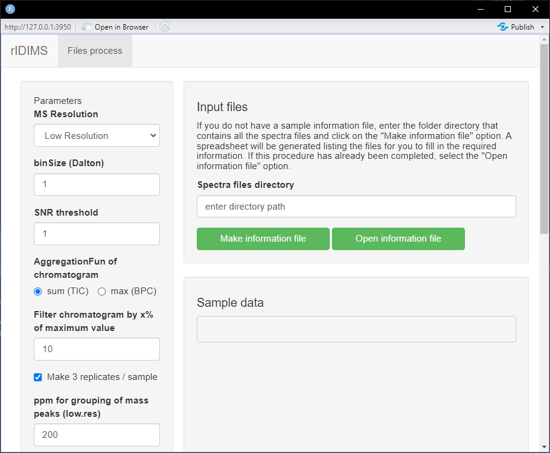
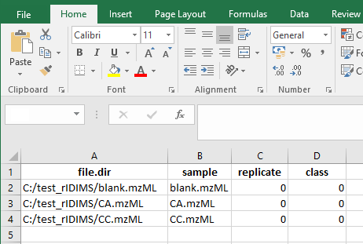
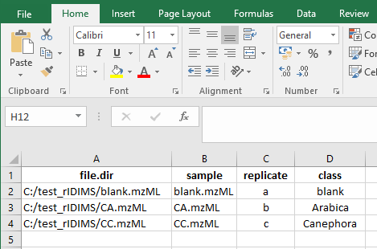
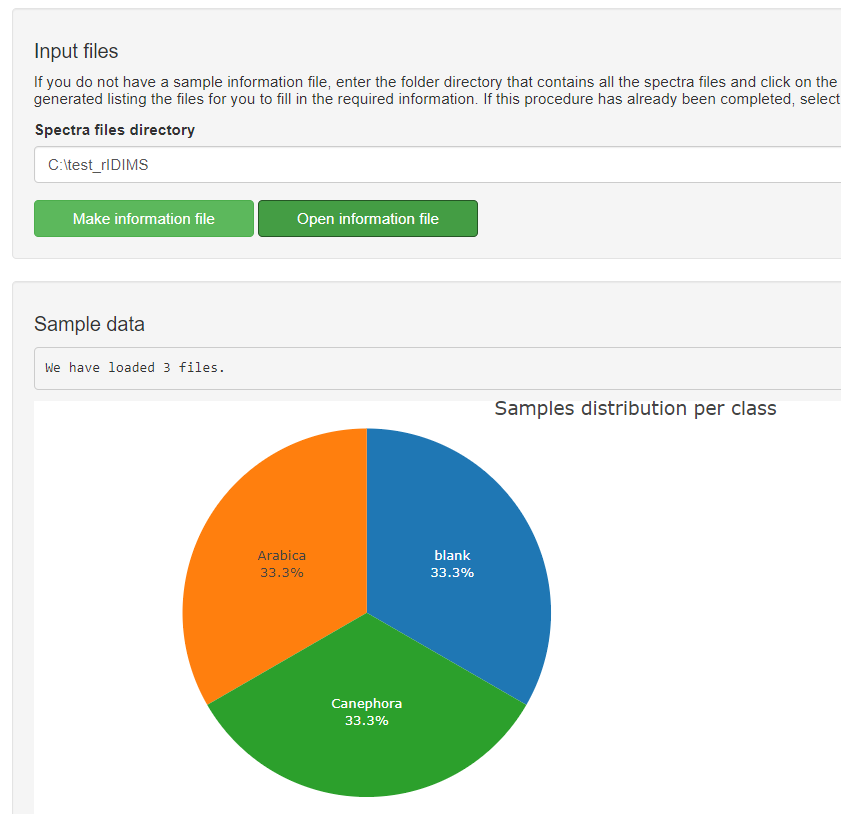
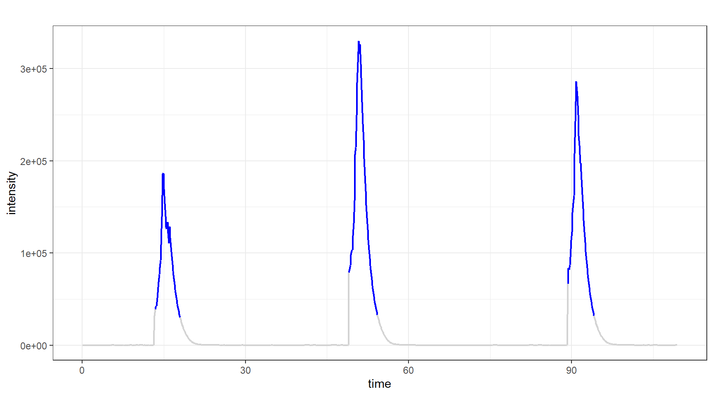
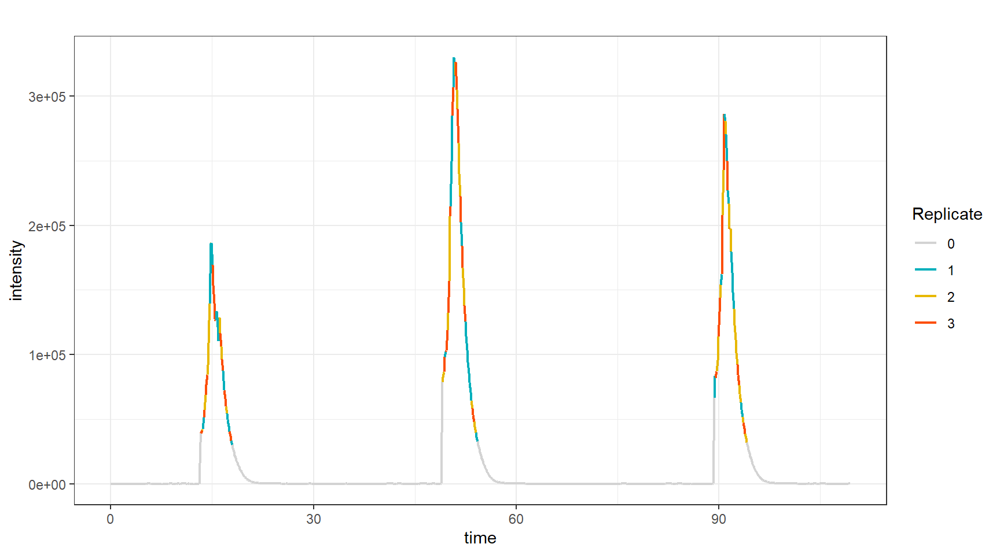
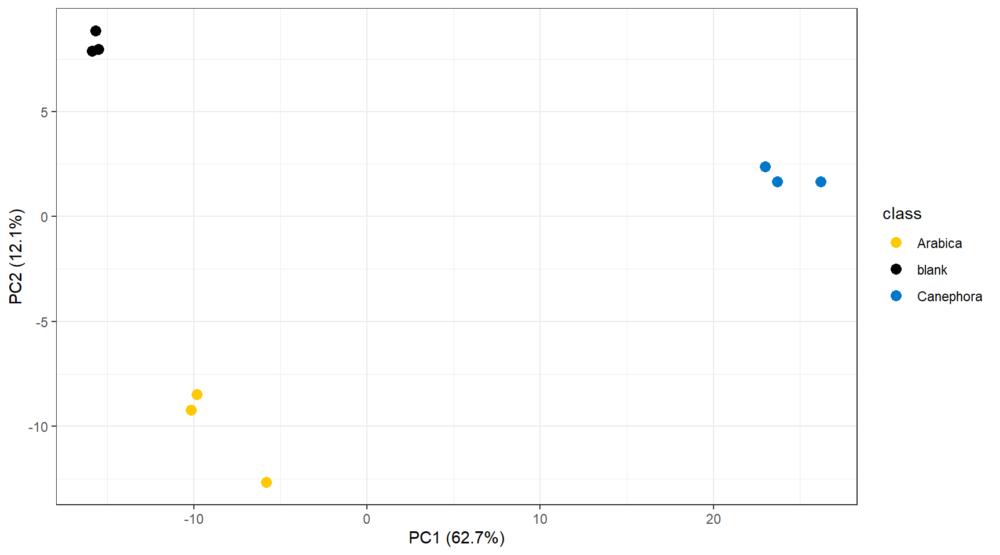
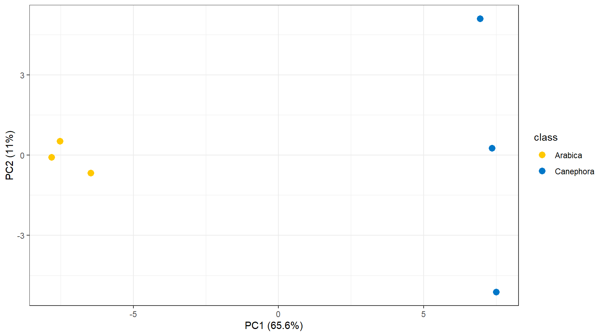
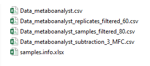

**Last modified:** `r file.info("rIDIMS.Rmd")$mtime`<br />
**Compiled**: `r date()`

```{r, include = FALSE}
knitr::opts_chunk$set(
  collapse = TRUE,
  comment = "#>"
)
```

# Introduction

This document describes how to use the **R** package `rIDIMS` for the analysis of direct-injection mass spectrometry data. 
\
In this tutorial we will demonstrate the advantage of generating in-silico replicas in cases of limited sample analysis. Often in real analysis cases there is a physical size limitation or small sample volumes, making it only feasible to perform one injection. In these cases, it is interesting that there is a robust and reproducible statistical process for obtaining representative scans of the analyzed sample.


# Data:  Coffea arabica and Coffea canephora Beans

We used the MasSpec pen coupled to a mass spectrometer (LTQ-XL, Thermo Scientific) to quickly and directly analyze the chemical profiles of coffee beans from 2 coffee species: Coffea arabica L. (arabica) and Coffea canephora var. robust (robust). In summary, the dataset consists of 64 files divided into the following categories: blank, Arabica coffee and Robusta coffee. \
To demonstrate the usefulness of generating in-silico replicas, in this example we will use only 3 mzML files representative of each category.

# Installation

The package should be installed with the `pak` package. To
install `pak` use:
```{r setup, echo = T, message = FALSE, warning=FALSE}
install.packages("pak")
```
\
After that install rIDIMS: 

```{r setup, echo = T, message = FALSE, warning=FALSE}
pak::pkg_install("url::https://github.com/BioinovarLab/rIDIMS/releases/download/v1.8.310/rIDIMS_1.8.310.tar.gz")
```

\
Start rIDIMS application: 

```{r setup, echo = T, message = FALSE, warning=FALSE}
library(rIDIMS)
```

# Data preparation

First create a folder for your project. In this case we will create the *test_rIDIMS* folder.

```{r echo = T, results = 'hide'}
test.path <- "C:/test_rIDIMS"
dir.create(test.path, showWarnings = FALSE)

```

Now let's move the coffee project files to the created folder.


```{r echo = T, results = 'hide' }
file.copy(list.files(system.file('extdata', package = 'rIDIMS'), 
                     full.names = TRUE), test.path, overwrite = TRUE)


```

With the mzML files in your project folder you don't need to create anything else manually. rIDIMS will now take care of creating the spreadsheet with sample information and general processing.


# Run rIDIMS

To open rIDIMS, enter the command below and wait for the application to load.

```{r echo = T, results = 'hide' }
rIDIMS::start_rIDIMS()
```

After loading, the following screen should appear

```{r echo=F, out.width="100%"}

```

The application window is divided into two parts, on the left side we have the parameters that must be used
in data processing. While on the right side we have sample information. \
In the "Spectra files directory" field, enter the path of your project folder.
In this case *C:/test_rIDIMS*, then click the button "Make information file".

# Information file

After clicking the button, wait for the *samples.info.xlsx* file to be created automatically
in your project folder. It will open with your system's native program for .xlsx files.
The following screen is expected.

```{r echo=F, out.width="100%"}

```

Now fill in according to the replicas and classes of your samples. In this case we only have 3 cases: blank, arabica and canephora. It is important that the codes used for replicas of different classes are not the same. Always use distinct replica codes.

```{r echo=F, out.width="100%"}

```

Once this is done, close the editor program and you will be ready to load the data into the application. Click on the "Open information file" button and wait for the data to load. The following screen should appear.

```{r echo=F, out.width="100%"}

```

After checking the sample information and configuring the parameters for processing, everything is ready to go.
start the process. To do this, click on the button below "Start process!". \
You can monitor the status of the process through a log file (.txt) that is generated in the project folder. \
Wait for the processing to finish and the report to be generated.

# Analyzing the report

At the end of the process, the message displays the HTML report path. If the report does not open automatically, go to the project folder and open it manually.

The report begins by showing the main processing parameters, with the total list of parameters at the end of the log file.
It then shows how the sample scans were selected, showing the scan selection process based on intensity and then their distribution in the set of 3 replicates.\ 
Below you can see the raw chronogram of the CA sample.


```{r echo=F, out.width="100%"}

```

Note that the selection does not follow a static pattern as it is done dynamically to generate a set of scans that have no statistical difference between them. More details about this algorithm can be found in the publication's article. The distribution of scans can be viewed below in the chronogram through the colors of each replica.

```{r echo=F, out.width="100%"}

```

Then, sample processing begins following the following steps:

* Evaluate features of replicates
* Subtraction of blank (or other) class
* Filter samples

The effect of these steps can be visualized through Principal Component Analysis (PCA) before and after processing.
Below you can see the PCA of the samples before processing.

```{r echo=F, out.width="100%"}

```

And below the PCA after processing.

```{r echo=F, out.width="100%"}

```

The analyzes generate a report and log with specific names (date and time), so you can test several different parameters and then evaluate performance by comparing the generated files. \
Each processing step generates a .csv file with the step's dataset formatted to be used as input in MetaboAnalyst (https://www.metaboanalyst.ca/) directly. This way, you can independently evaluate the effect of each step quickly and easily.

```{r echo=F, out.width="100%"}

```


